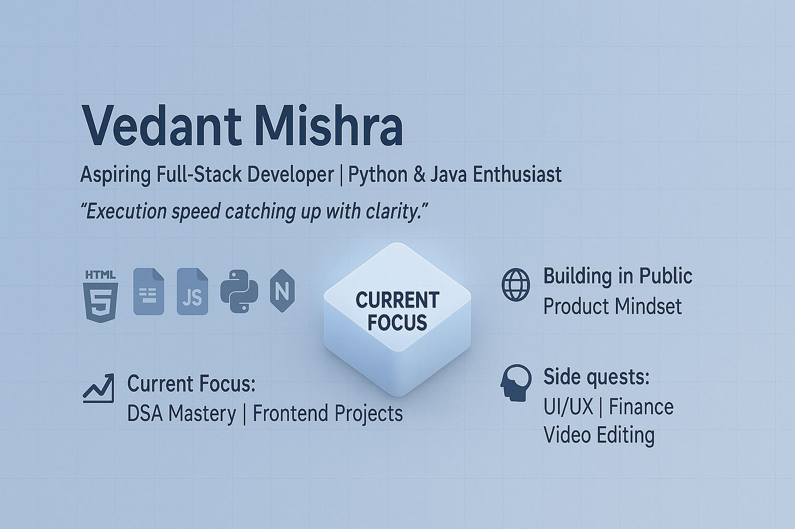

<h1 align="center">Hi 👋, I'm Vedant Mishra</h1>
<h3 align="center">A passionate frontend developer from India</h3>

  

- 🌱 I’m currently learning **Full Stack Development.**

- 👨‍💻 All of my projects are available at [https://github.com/VedantMishra05](https://github.com/VedantMishra05)

- 💬 Ask me about **Web Development, Core Java, Advanced Python**

- 📫 How to reach me **vedantmishra3421@gmail.com**

<h3 align="left">Connect with me:</h3>

<h3 align="left">Languages and Tools:</h3>

           

&nbsp;

